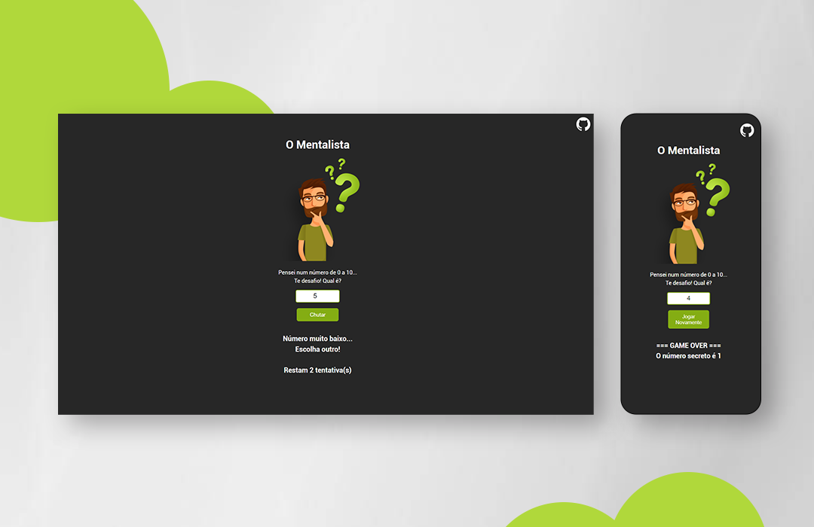

  

 

<h1>O Mentalista</h1>

<h3 align = "center">
  Tente adivinhar o número secreto, em 3 tentativas.
</h3>

<h4 align = "center">
	versão 2.3 ✅
</h4>
 
<h3 align = "center">
<a href="https://matealves.github.io/omentalista/" target="_blank">Acesse o site - clique aqui!
</a> 
</h3>

 

 <a href="#visao">• Visão geral</a>  
 <a href="#leng">• Linguagens</a>  
 <a href="#contato">• Contato</a>  

 
 

<h1>  Visão geral </h1>
O Mentalista é um jogo de adivinhação, onde é sorteado um número aleatório que o usuário não tem sabe qual é, e deve-se tentar descobrir o número em até 3 tentativas. Convide alguém para um desafio e veja quem tem mais sorte!

 
 
 

<h1>  Linguagens utilizadas </h1>

 
  
  

 
 
 

<h1> Como entro em contato? </h1>

Entre em contato através dos links a seguir!
 
 

 
 
 